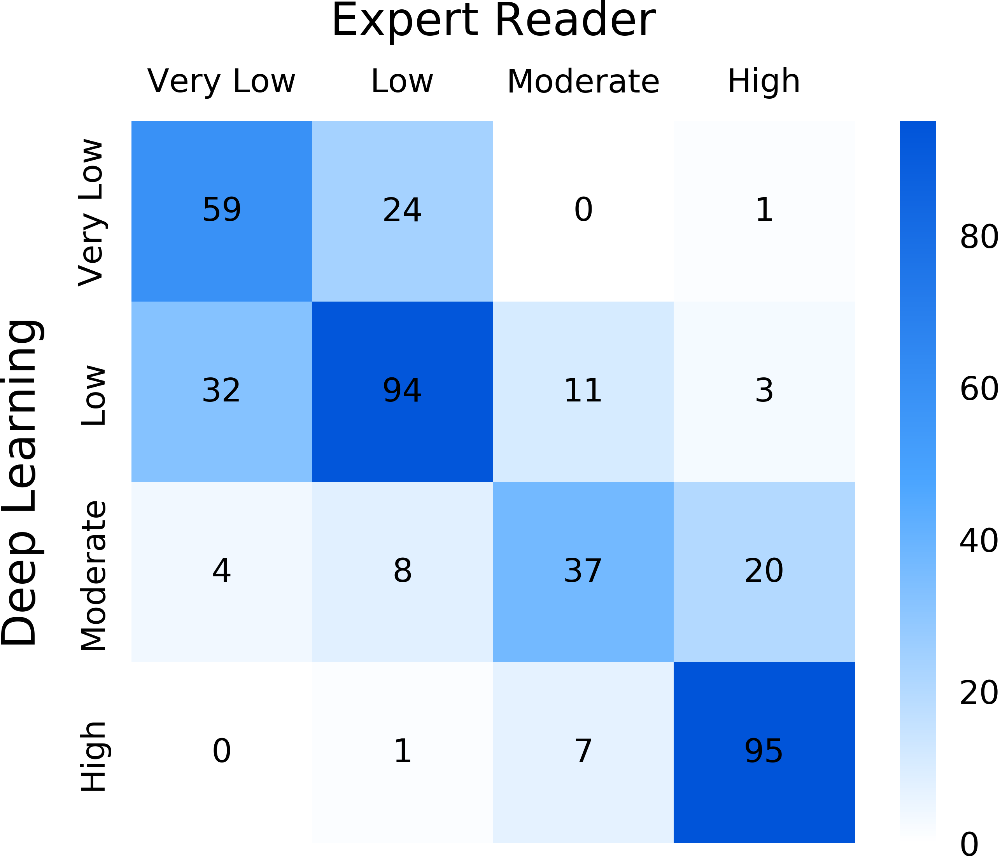
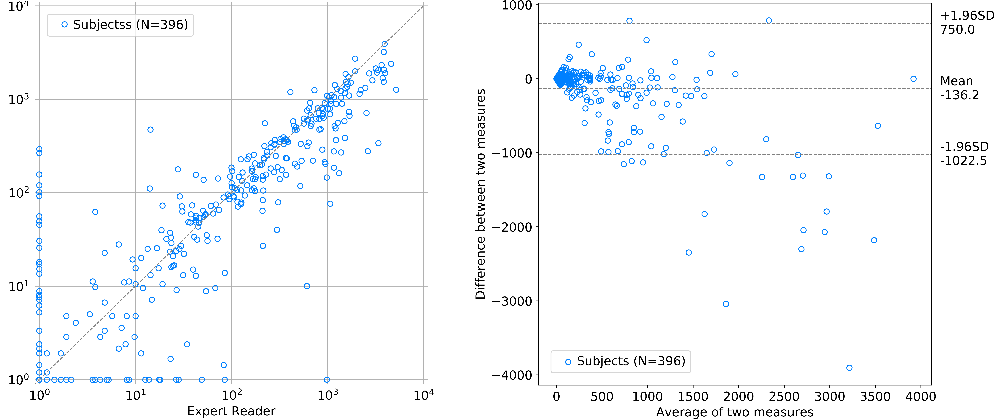

# Statistical Analysis
This folder contains the code to reproduce the statistical analysis 
of our paper _Deep convolutional neural networks to predict cardiovascular 
risk from computed tomography_.

We provide the automatically predicted as well as manual calcium scores for 396 cases from  the National Lung Screening Trial (NLST). This sub-group was randomly selected from the full NLST cohort. In order to be able to reproduce all the statistical analyses, the image and outcome data needs to be obtained from the National Cancer Institute (NCI). Such data request can be made at [the dedicated NIH-NCI webpage](https://biometry.nci.nih.gov/cdas/nlst).

## Image Selection for Each Individual

As several CT scans are available for most of the individuals, we 
created a series of criteria for selecting the images to analyze.

- **CT Scan Time Point:** For all individuals, a baseline scan plus up to two 
  follow up scans were acquired. For our study, only baseline scans (T0) were 
  used.
- **Slice spacing:** The three networks were trained on CT Series with a slice 
  spacing of 2.5mm. As the vast majority of scans in our NLST cohort had a 
  slice spacing of 2.5mm or less, we excluded all scans with a larger 
  spacing and kept only scans with a spacing of 2.5mm, 2.0mm, 1.75mm, 1.25mm, 
  or 1.0mm. If several scans were available we chose the one with a spacing 
  closest to 2.5mm.
- **Reconstruction kernel:** As the scans in our training cohorts 
  were reconstructed using soft kernels, we favored scans with a soft kernel 
  over scans with a hard kernel when several scans were available for an 
  individual. For selecting a kernel, we created a list of all available 
  kernels in the cohort and sorted them from soft to hard resulting in the 
  following: 
  
  _[B31f, B30f, B20f, C, FC10, FC11, FC02, STANDARD, BODY, B50f, B60f, B70f, 
  B80f, D, FC51, FC53, BONE, LUNG]_
  
## Preprocessing
- **Check for duplicate slices:** In some cases two (almost) identical CTs 
  are stored in one folder. In this case each CT slice is duplicated and one 
  of them has to be removed. 
- **Conversion to NRRD:** The manual heart segmentations masks for all our cohorts
  were drawn using the open source software _3D Slicer_ [[1]](#1) and saved 
  in the NRRD format. Therefore, in order to be processed by the pipeline,
  DICOM images need to be converted to such format. An easy way for converting images is
  described [in the "Input Data Format" section of the README file under the data directory](https://github.com/AIM-Harvard/DeepCAC/tree/main/data).
- **Image size and resolution normalization:** All CT scans need to have a size 
  of 512×512×512 voxels. Larger scans can be cropped to the center, as the heart will 
  still be visible entirely in the scans (normally, the organ is not located close 
  to the scan border). Smaller scans need to be padded, and the additional area 
  filled with voxels taking the value of -1024. Furthermore, the scans need to be 
  resampled to an in-plane resolution (pixel-spacing) of 0.68mm/px and a 
  plane-distance (slice-spacing) of 2.5mm/px.
  
## System Requirements
- **General Software:** Python V2.7.17; pip V20.2; R V3.6.3; RStudio V1.3.
  1073; 
- **Data processing:** Python V2.7 - Packages: pycicom V1.4.2; SimpleITK V1.
  2.4, Numpy V1.16.6; Scipy V1.2.3; h5py V2.10.0;
- **Results analysis:**
  - Python: Packages: scikit-learn package V0.20.4; Scipy V1.2.3; 
  - R: Packages: ICC v2.3.0; Survcomp V1.36.1; Survminer V0.4.8; Survival 
    V3.2.3
    
## Files - Data and Statistics

### CSV:
- **Results_NLST.csv:** AI and manual CAC scores
### Python:
- **AIvsManual.ipynb:** Scatter plot and Bland Altman plot
- **Concordance.ipynb:** Concordance table, Concordance rate, and Cohen's Kappa
### R:
- **COX.R:** Cox regresseion, univariate and multivariable
- **ICC_AUC.R:** Intraclass Correlation
- **KM.R:** Kaplan-Meier curves

## References
<a id="1">[1]</a> S. Pieper, M. Halle and R. Kikinis, "3D Slicer," _2004 2nd 
IEEE International Symposium on Biomedical Imaging: Nano to Macro (IEEE Cat No. 
04EX821),_ Arlington, VA, USA, 2004, pp. 632-635 Vol. 1, doi: 10.1109/ISBI.
2004.1398617.

## Disclaimer
The code and data of this repository are provided to promote reproducible 
research. They are not intended for clinical care or commercial use.

The software is provided "as is", without warranty of any kind, express or 
implied, including but not limited to the warranties of merchantability, 
fitness for a particular purpose and noninfringement. In no event shall the 
authors or copyright holders be liable for any claim, damages or other 
liability, whether in an action of contract, tort or otherwise, arising 
from, out of or in connection with the software or the use or other 
dealings in the software.
